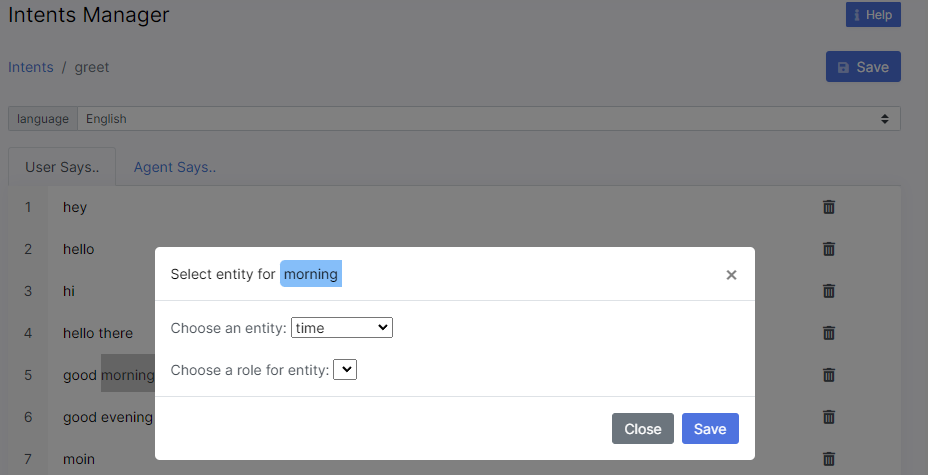
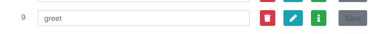

# Intents

Intent is all about the motive of a given chatbot user. It’s the intention behind each message that the chatbot receives from the user. Intents categorize text based on the intent, goal or purpose expressed in the user’s message. For example, the intent "greetings" enables your bot to understand when the user says Hi. This creates a simple question-answer dialogue that provides a response to messages categorised to the intent.

## Creating Intents

To add intents to your selected chatbot, you click on the `New Intent` button. You will be prompted to enter an intent name, then click create intent, as shown in Figure 3. 

Once an intent has been created, click on the edit intent button to provide example messages belonging to the intent under the "User Says.." tab, as well a list of possible responses that the bot should respond with under the "Agent Says.." tab. Figure 4 shows the user interface for providing example messages and responses.

It is important to provide examples to the appropriate language; this is because on the backend, an intent classifier is trained for each language and a pre-trained language model for each intent classifier is used to create embeddings for the classifier to train accurately with fewer example messages. To change between predefined languages, you select the language from the drop-down list of language(s) that you defined when creating the bot.

Once you have provided a list of example messages and possible responses in different predefined languages, you click on the `Save` button to save the created intents of your bot.

## Variable Tagging
The intent manager allows you to tag entities in the example user messages that you provide for an intent. Simply highlight the variable example in your example text and a modal will pop up prompting you to select the variable that the example belongs to. Entities are discussed in more detail in the [Entities] section of the Bot Builder documentation.

## Deleting an Intent
Before you delete an intent, ensure that it is not in use in the dialog manager. To delete an intent, you click on the Delete button. If you delete an intent, you also delete all of its related content and you can not restore it. You will be asked to confirm the action by clicking the `Delete Intent` button as shown in figure 6.

:::danger

Please note that if you delete an intent, all the examples and responses also get permanently deleted.

:::
